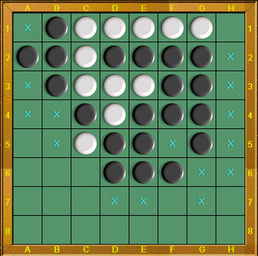
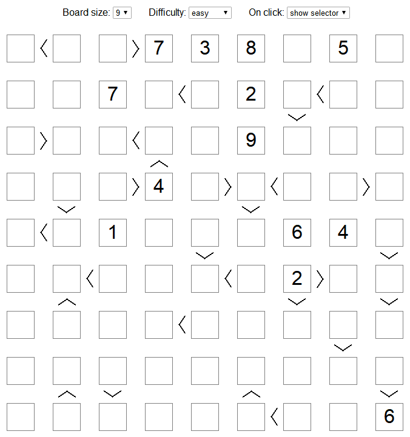
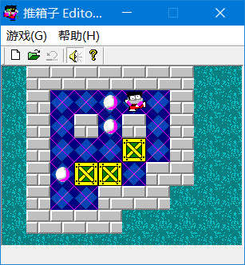
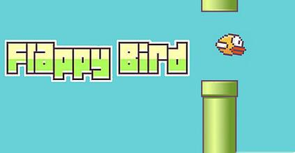
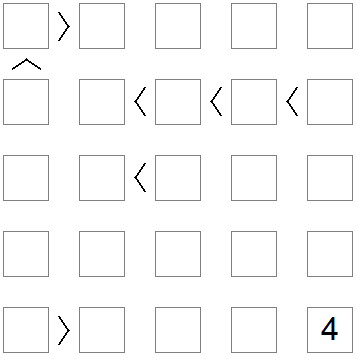
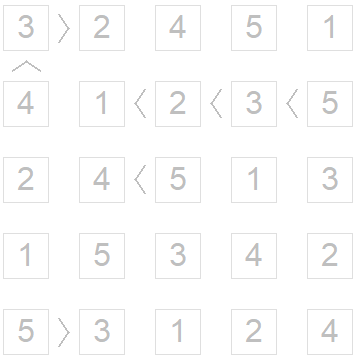

# Artificial Intelligence

This is the repository of chhzh123's assignments of *Artificial Intelligence* - Fall 2019 @ SYSU lectured by *Yongmei Liu*.

There are 16 [labs](#labs), 4 [projects](#projects), and 4 [theory assignments](#theory-assignments) in this course. Brief introduction is listed below, and detailed descriptions can be found in each folder.

The assignments are primarily coded in Python, expect for some listed below use other languages.
* E03 uses C++
* E05, E06, P02 (Part 2) use [Prolog](https://www.swi-prolog.org/)
* E07, E08, P03 (Part 1) use PDDL Planner, please refer to the following links
    * Online PDDL Planner, <http://editor.planning.domains/>
    * Metric-FF Planer, <https://fai.cs.uni-saarland.de/hoffmann/metric-ff.html>

## Labs
Lab assignments have the prefix `E`.

### E01 - Maze
Use **BFS** or **DFS** to solve the maze problem (i.e., find the shortest path from the start point `S` to the ending point `E`).

```
%%%%%%%%%%%%%%%%%%%%%%%%%%%%%%%%%%%%
%                                 S%
% %%%%%%%%%%%%%%%%%%%%%%% %%%%%%%% %
% %%   %   %      %%%%%%%   %%     %
% %% % % % % %%%% %%%%%%%%% %% %%%%%
% %% % % % %             %% %%     %
% %% % % % % % %%%%  %%%    %%%%%% %
% %  % % %   %    %% %%%%%%%%      %
% %% % % %%%%%%%% %%        %% %%%%%
% %% %   %%       %%%%%%%%% %%     %
%    %%%%%% %%%%%%%      %% %%%%%% %
%%%%%%      %       %%%% %% %      %
%      %%%%%% %%%%% %    %% %% %%%%%
% %%%%%%      %       %%%%% %%     %
%        %%%%%% %%%%%%%%%%% %%  %% %
%%%%%%%%%%                  %%%%%% %
%E         %%%%%%%%%%%%%%%%        %
%%%%%%%%%%%%%%%%%%%%%%%%%%%%%%%%%%%%
```

### E02 - 15 Puzzle
Use **IDA\*** to solve the 15-Puzzle problem.


### E03 - Othello
Use **minimax** and **Alpha-Beta pruning** to implement the [Othello](http://www.tothello.com/index.html) game.



### E04 - Futoshiki
Use **forward checking (FC)** algorithm to solve the [Futoshiki](http://www.futoshiki.org/) puzzle.



### E05 - Family
Use **Prolog** to describe the family relationship, and answer the quiries about some relationship, e.g. m-th cousin n times removed.


### E06 - Queries on Knowledge Base
Given a Knowledge Base describing the distribution of branches of 10 well-known restaurants in Guangzhou. Use **Prolog** to answer the queries like

```
What districts have restaurants of yuecai and xiangcai?
What areas have two or more restaurants?
Which restaurant has the longest history?
```

### E07 - FF Planer
Define the domains and problems of *8-puzzle* and *blocksworld* using **PDDL**, and use **FF Planer** to plan a schedule.

### E08 - Boxman
Transform the boxman game into a planning problem, and use **FF Planer** to obtain the movements of the boxman.



### E09 - Bayesian Network
Build Bayesian networks of two problems (Bureglary & Diagnosing) using Python package **Pomegranate** and do the inference.


### E10 - Variable Elimination
Implement the **Variable Elimination (VE)** algorithm for Bayesian network and solve the above Bureglary problem.

### E11 - Decision Tree
Implement the **ID3** decision tree. (Notice: Not allowed to use existing ML packages like `sklearn`.)

Use the [Adult Dataset](http://archive.ics.uci.edu/ml/datasets/Adult) to predict whether a person makes over 50K a year.

### E12 - Naive Bayes
Implement the **Naive Bayes** algorithm.

Again, use the [Adult Dataset](http://archive.ics.uci.edu/ml/datasets/Adult) to make a prediction.

### E13 - Expectation-Maximization (EM)
Implement the **EM algorithm** and classify the given 16 footbool teams into 3 classes according to their performance.

### E14 - Backpropagation
Implement the **backpropagation** algorithm for neural network.

Use the [horse colic dataset](http://archive.ics.uci.edu/ml/datasets/Horse+Colic) to predict whether a horse with colic will live or die.

### E15 - Reinforcement Learning
Implement the **Q-Learning** algorithm and train the model for the [flappy bird](http://flappybird.io/) game.



### E16 - Deep Learning
Implement a three-layer **Convolutional Neural Network (CNN)** using the [CS231n framework](http://cs231n.github.io/assignments2019/assignment2/) and do the classification on [CIFAR_10 Dataset](https://www.cs.toronto.edu/~kriz/cifar.html). (Notice: Not allowed to use DL frameworks like `tensorflow` and `pytorch`.)

## Projects
Project assignments have the prefix `P`.

### P01 - Pacman
This project uses the material of [UC Berkeley CS188: Intro to AI](http://ai.berkeley.edu/home.html) - [Project 1: Search](http://ai.berkeley.edu/search.html), and needs to implement the **BFS, DFS, UCS, A\* Search** and design my own **heuristic functions** for the problems.


### P02 - CSP & KRR
1. Implement the **Generalized Arc Consistency (GAC)** algorithm for the [Futoshiki](http://www.futoshiki.org/) problem.

<table><tr>
<td></td>
<td></td>
</tr></table>

2. Implement a planner for the following blocksworld problem using **Prolog**.


### P03 - Planning & Uncertainty
1. Define the 2\*2 [rubik cube](https://rubiks-cube-solver.com/2x2/) problem in **PDDL** and solve it in **FF Planner**.


2. Solve the *Diagnosing* problem using **Bayesian Networks** with **Variable Elimination (VE)** algorithm (similar to E09 & E10).

### P04 - Reinforcement Learning
This project uses the material of [UC Berkeley CS188: Intro to AI](http://ai.berkeley.edu/home.html) - [Project 3: Reinforcement Learning](http://ai.berkeley.edu/reinforcement.html), and needs to implement the **value iteration, Q-Learning, and epsilon greedy algorithms**.

## Theory Assignments
Theory assignments have the prefix `T`.

### T01 - Searching
1. Uniform-cost search (UCS) with cycle checking
2. A\* search
3. Alpha-Beta Pruning

### T02 - CSP & KRR
1. Constraint Satisfaction Problem (CSP) formulation
2. Forward Checking (FC) & Generalized Arc Consistency (GAC) algorithm
3. Knowledge Representation (resolution)
4. Knowledge Representation (resolution)

### T03 - Planning & Uncertainty
1. Deterministic planning
2. STRIPS representation
3. Bayesian Network
4. Variable Elimination (VE) algorithm

### T04 - Machine Learning
1. Decision tree
2. Bayesian learning
3. Naive Bayes
4. Neural network (XOR) construction
5. Backpropagation algorithm