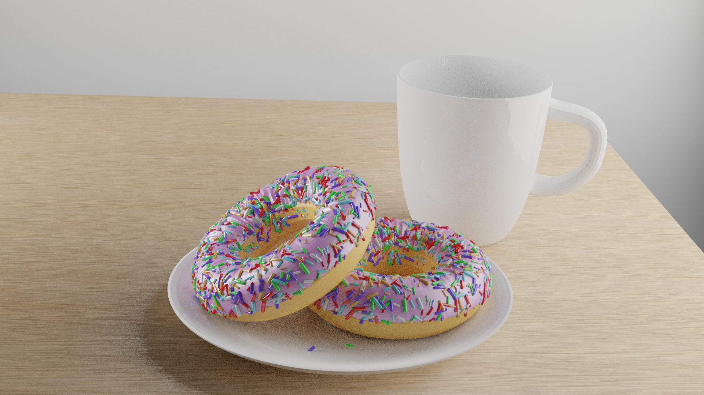
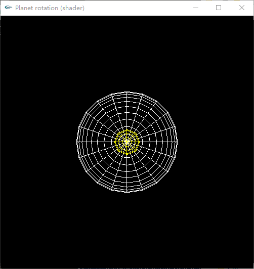
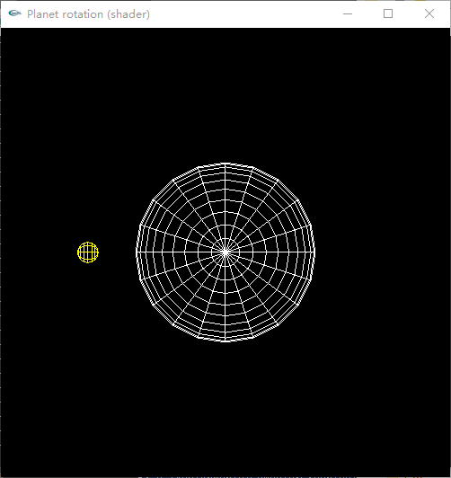
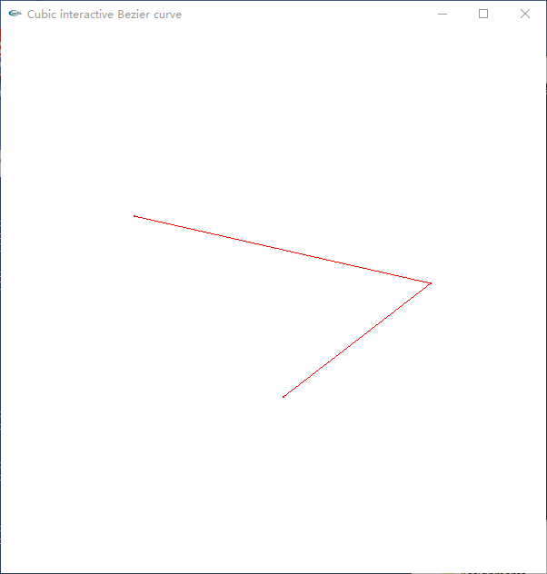
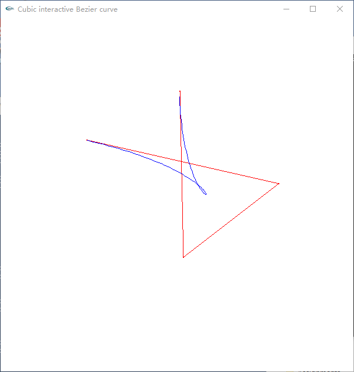
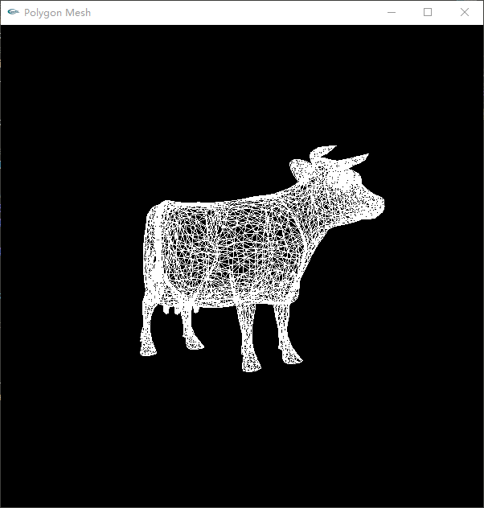
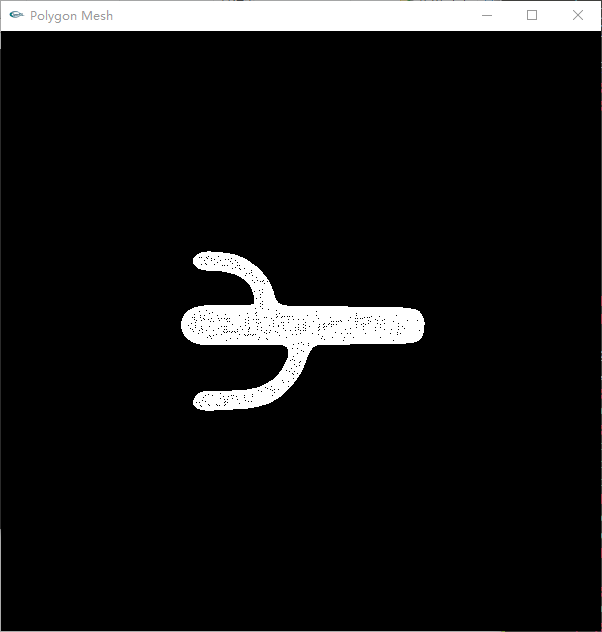
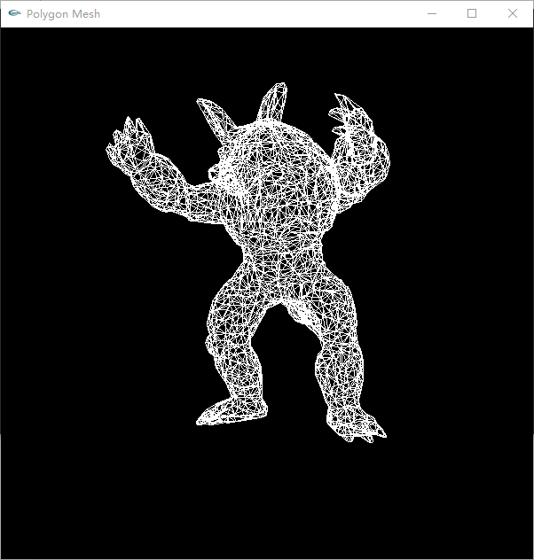
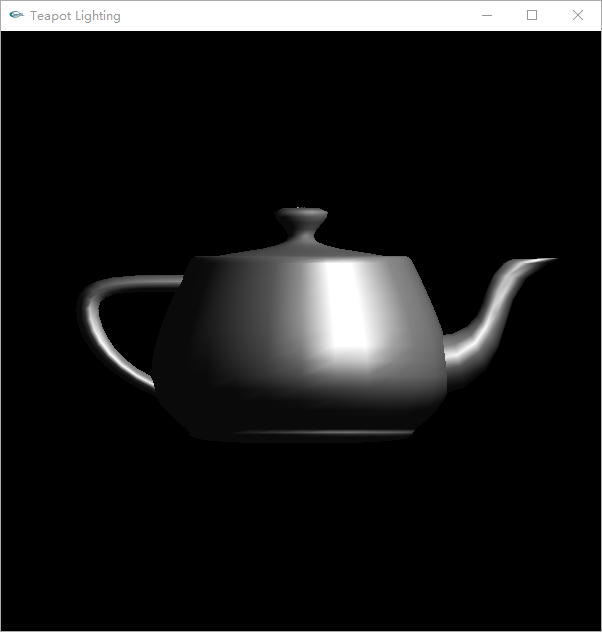

# Computer Graphics (CG)

This is the repository of chhzh123's assignments of *Computer Graphics* - Fall 2019 @ SYSU lectured by *Zhuo Su*.

There are 6 assignments and 1 final project for this course.

## Assignment 1
Summary of ACM SIGGRAPH'19 Conference topics

## Assignment 2
Use [Blender](https://www.blender.org/) to render the 3D scene. The following figure is implemented and rendered on my own.



## Assignment 3
Use [OpenGL](https://www.opengl.org/) shader ([glsl](https://learnopengl.com/Getting-started/Shaders)) to implement the planet rotation. The following figures are rendered on my own.

<table><tr>
<td></td>
<td></td>
</tr></table>

## Assignment 4
Implement the interactive Bezier curve as shown below.

<table><tr>
<td></td>
<td></td>
</tr></table>

## Assignment 5
Read in `obj`, `ply`, and `off` model files and display them on the screen using OpenGL. Click some keys to make them rotate or change the display mode.

<table><tr>
<td></td>
<td></td>
<td></td>
</tr></table>

## Assignment 6
Implement the lighting effect (smooth shading) on [Utah teapot](https://en.wikipedia.org/wiki/Utah_teapot) using OpenGL.



## Final Project
We leverage the [Taichi](https://github.com/taichi-dev/taichi) programming language to implement some physical simulations. Details can be found in our report. The related paper is listed below.

```
Taichi: A Language for High-Performance Computation on Spatially Sparse Data Structures
Yuanming Hu, Tzu-Mao Li, Luke Anderson, Jonathan Ragan-Kelley, and Frédo Durand
SIGGRAPH Asia, 2019
```