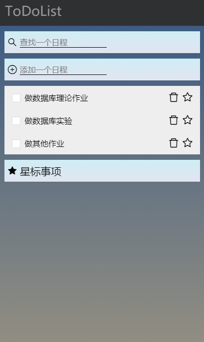
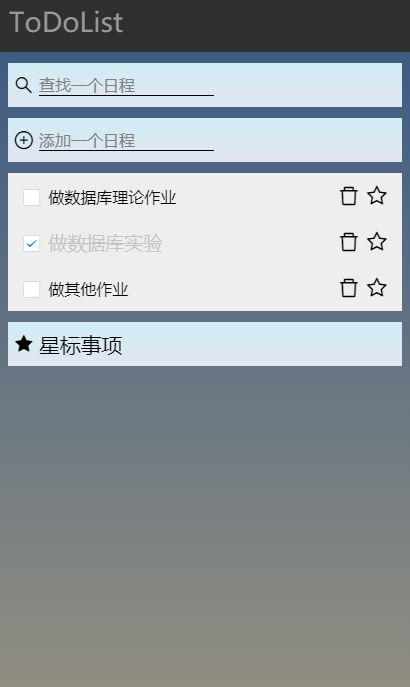
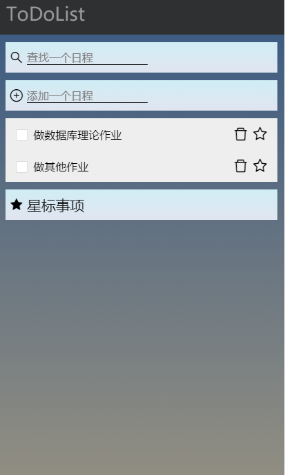
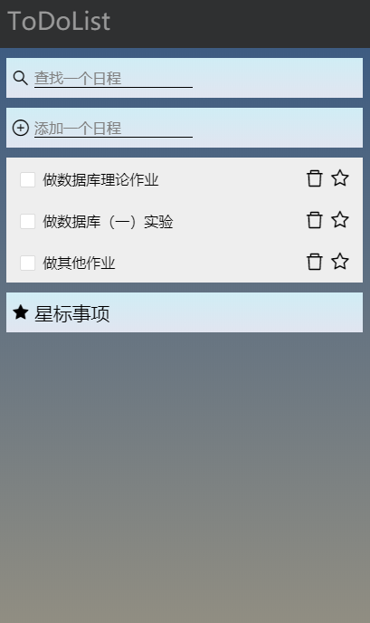

# Database Systems

This is the repository of chhzh123's assignments of *Database Systems* - Fall 2019 @ SYSU lectured by *Rong Pan*.

## Assignment 1
This assignment needs to implement a simple TodoList.

I use [UniApp](https://uniapp.dcloud.io/) and [Vue.js](https://cn.vuejs.org/) to build the app and test it on the browser. Codes can be found in the folder. The following figures show the basic operations of **adding, finishing, deleting, and modifying** the todo items.

<table><tr>
<td></td>
<td></td>
<td></td>
<td></td>
</tr></table>

## Assignment 2
This assignment is from the [Laboratory Exercises](https://www.db-book.com/db6/lab-dir/labexercises-dir/) of [Database Systems Concepts (6th ed)](https://www.db-book.com/db6/), which requires to be familiar with the basic usage of MySQL.

## Assignment 3
This assignment needs to grab the webpages of 100 Chinese universities. The steps are listed below.

1. Read in school task list
2. Grab the offical webpage links of these universities from [Sunshine Gaokao](https://gaokao.chsi.com.cn)
3. Grab and save these schools' webpages

## Project
We implement a chat robot named [AIDO](https://github.com/chhzh123/AIDO) to help you manage the schedule. Details can be found in this [repository](https://github.com/chhzh123/AIDO).