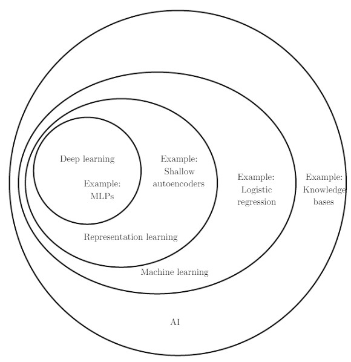

# Deep Learning Intro (Week 01)

## Catalog
* Deep learning
* Representation learning
* Machine learning
* Artificial intelligence

## History
* Cybernetics [1940s-1960s]
* Connectionism [1980s-1990s]
* Deep Learning [2006-]
	* 2018 Turing Award
		* Geoffrey Hinton
		* Yoshua Bengio
		* Yann LeCun

## Impetus
* Data
	* ImageNet
* Algorithms
	* Deep NN
		* CNN
		* RNN
		* GNN
* Systems
	* TensorFlow [2015]
	* PyTorch [2016]
* Hardware
	* GPU

## Applications
* Healthcare
* Game & Chess
* Face recognition
* Self-driving
* Image translation
* Speech recognition
* Language translation
* ...

## Linear Regression (Supervised)
* Formulation
	* y=Wx+b
* Data
	* (x_i,y_i)
* Optimization
	* MSE

## Classifier (Supervised)
* Model
	* CNN
* Loss
	* CrossEntropy
* Optimization
	* Gradient descent

## Research
* Novelty
	* Applications
	* Problem Formulation
	* Models
	* Research Process
* Re + Search!
* Deep learning of deep learning!