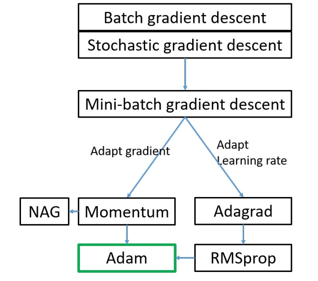

# Week 03 - Optimization

## Backpropagation
* Chain Rule
* Gradient Descent

## Avoid Overfitting
* Dataset splitting
	* Training set (60%)
	* Validation set (20%)
	* Test set (20%)
* Early stopping
* Regularization
	* Lp-norm
	* Dropout
* Data augmentation
	* rotate
	* scale
	* translate
	* flip
	* shear
	* illumination change
* Ensemble model
	* average
	* voting
* Surprising theory
	* "Network is bias toward simple functions!"

## AI Conferences
* ICML
* NeurIPS
* ICLR
* AAAI
* IJCAI
* CVPR
* ICCV
* ECCV