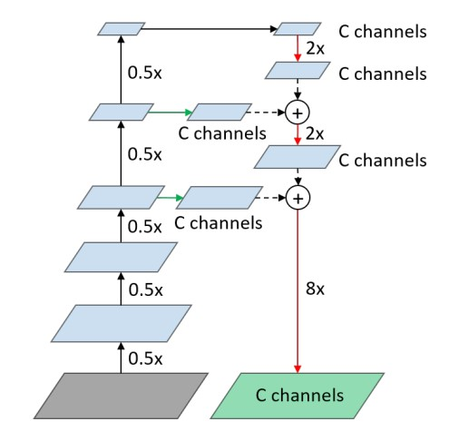
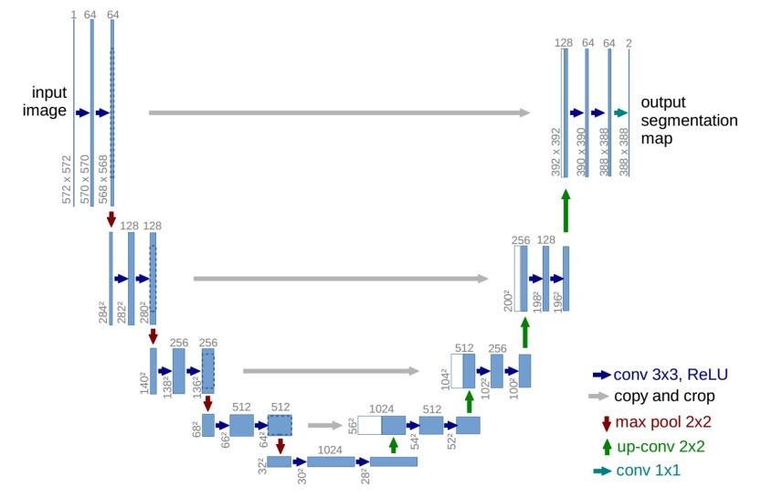
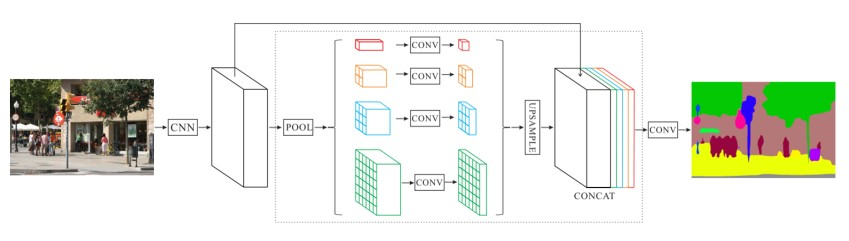
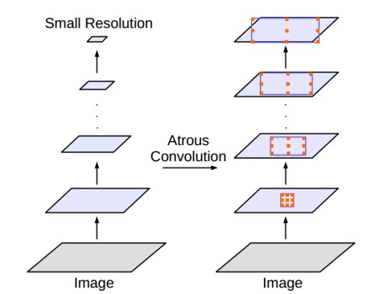

# Week 05 - 语义分割

## 简介
* 是什么
	* 图片分类CNN：图像->类别
	（**图像级**分类）
	* 语义分割FCN：像素->像素
	（**像素级**分类）
* 应用
	* 自动驾驶
	* 智能家居
	* 医学影像
* 传统方法
	* 滑动窗口
		* 取像素周围一小块送入CNN分类
	* 输出C个通道
	* 问题
		* 仅捕获局部特征
		* 大量重复计算
		* 内存消耗大

## 全卷积网络(FCN)
* 编码解码架构
	* 降采样(downsampling)
		* 池化
		* 卷积
	* 上采样(upsampling)
		* 反卷积
		* 插值
* 全卷积网络
Long [CVPR'15]

	* 全连接层转为全卷积
		* 最大的局部=全局
		* 突破输入尺寸限制
		（输入输出等大）
	* 核心
		* 上采样：低分辨率+高分辨率
		* 同时捕获细/粗特征

## U-Net [MICCAI'15]

* 方法
	* 相同次数的下/上采样
	* 编码解码**跳层**连接
	（类似ResNet）
	* 上采样+编码层
	（类似FCN）
* 问题
	* 没有很好捕获全局信息
* 扩展
	* Tiramisu net = U-Net + Dense ResNet
	[CVPR'17]
	* PSPNet [CVPR'17]
		
		* 编码器：空洞卷积
			* 更大的感受野
		* 金字塔池化
			* 不同尺度捕获特征
		* 上采样+编码层
			* 捕获不同分辨率特征

## DeepLab [arXiv'17]
* 不同架构
	* 编码-解码结构
	* 直接使用空洞卷积
		* 避免编解码损耗
* v1
	
	* 降采样：VGG16+空洞卷积
	* 上采样：双线性插值
	* 细调：全连接条件随机场(CRF)
* v2
	* 不同rate的金字塔空洞卷积(ASPP)
		* 参照PSPNet
		* 捕获不同尺度特征
	* 多尺度输入
	* 预训练模型
* v3
	* Multi-grid
		* 多层不同rate的空洞卷积
	* 全局池化+conv1\*1
	* 批归一化+ASPP
	* bootstrapping
* v3+
	* 空洞卷积 + 编码-解码
		* 编码：降采样+ASPP
		* 解码：双线性插值+跳连
* 扩展
	* Gated shape CNN [ICCV'19]
	* Auto-DeepLab [arXiv'19]

## Future directions
* 先验知识
* 小样本学习
* 迁移学习
* 弱监督
* 集成