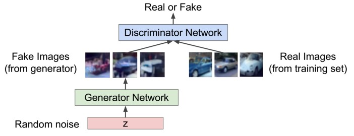
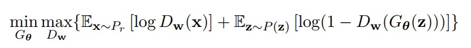
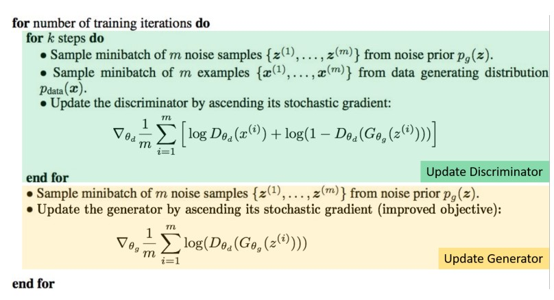

# Week 07 - GAN
## 简介
* 目标
	* 从训练数据中生成**新的**数据
* 应用
	* 现实感设计、超分辨率、着色
	* 数据增强：产生更多数据
	* 数据挖掘：探索数据隐含结构/表示
* 方式
	* 学习数据的密度分布，从该密度分布生成新数据
		* 难点：难以获得训练数据的密度分布
	* 直接生成/综合出数据
		* 核心：从简单分布（噪声）中采样并学习**变换**
		* 用神经网络表示变换
		* 目标是生成图像，其分布与原来训练数据相似

## GAN [NIPS'14]
### 核心架构

* 用另一个网络评判生成的图片与原本训练图片是否有相似分布
	* 生成器G：尝试用虚假的图片来欺骗D
	* 判别器D：尝试分辨真实和虚假的图片
* LaTeX formula
	
	* D_w是一个二分类器

### 训练
* 训练判别器D
	* 最大化内层函数，使得
		* D_w(x)对于真实图片接近于1
		* D_w(G(z))对生成的图片接近于0
* 训练生成器G
	* 最小化外层函数，使得
		* D_w(G(z))接近于1
		* 即使判别器认为G(z)是真的
* 纳什均衡
	* 生成器loss下降，生成图片越来越逼真
	* 判别器loss上升，越来越无法辨别生成或真实图片

### DCGAN [ICLR'16]
* 架构
	* 将全连接层换成卷积层
		* 生成器反卷积网络
		* 判别器卷积网络
	* 池化换成跳步卷积（判别器）和[分数步](https://datascience.stackexchange.com/questions/49299/what-is-fractionally-strided-convolution-layer)卷积（生成器）
	* batchnorm
	* 生成器ReLU+Tanh(末层)，判别器LeakyReLU
* 可解释向量算术
	* 类似word2vec

### LSGAN [ICCV'17]
* 用最小二乘代替交叉熵
	* 缓解梯度消失
	* 更加稳定

## 训练问题
* 不稳定
	* 判别器很好，loss变0；生成器梯度消失
	* 判别器不好，生成器的反馈糟糕，无法训练
* 模态坍塌(mode collapse)
	* 生成的图像较少变化
* 缺少恰当评价指标
	* 不知何时停止训练

## Wasserstein GAN [arXiv, 2017]
* 距离度量
	
	* 推土机距离(Wasserstein)
		* 从一个分布转换到另一个分布最少的移动量
		* 无法直接计算，转换为1阶Lipschitz函数，算sup
		* 放缩转换为
		
* 训练
	* 用w参数化f，用神经网络表示
	* 权重clamping到[-c,c]
	* 
		* 固定生成器，通过训练f_w计算估计W
		* 固定判别器/critic，通过采样优化更新生成器
* 权重裁剪问题
	* f_w只是K阶Lipschitz函数一个很小的子集
	* 梯度消失/爆炸
	* 将权重全部都推至两侧

## WGAN-GP [arXiv, 2017]
* 强化Lipschitz限制
	* 函数是1阶Lipschitz当且仅当它在任意点|\nabla|<=1.0
* 改进critic loss，添加了梯度惩罚项
* 训练速度比WGAN快
* 生成图像更加细致逼真