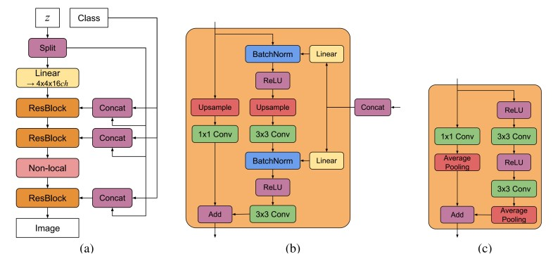
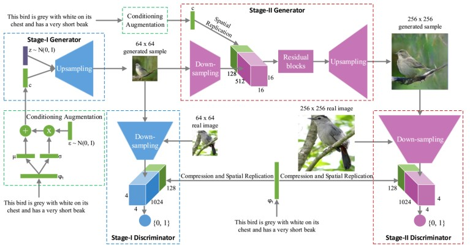
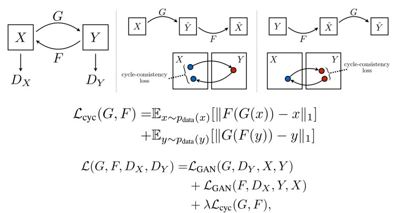

# Week 8 - GAN Applications
## Conditional GAN [arXiv'14]
* 将条件编码输入判别器和生成器
	* 条件可是类别标签的独热码
* BigGAN [ICLR'19]
	* 大批次及更多筛核
	

## 文字图像转换
* 将文字当成条件
* 问题
	* 细节部分过于粗糙
* StackGAN [arXiv'16]
	
	* 将两个CGAN堆叠
		* 将第1个生成器输出的低分辨率图像作为第2个生成器的输入
		* 形状轮廓、基本颜色->真实感图片

## 图片图片转换
* 图片风格转换
	* 在CG顶会上也会见到
* L1损失会带来模糊的结果
* 问题
	* 难以收集足够的图像pair
* CycleGAN [arXiv'17]
	* 
	* 将图片转到另一空间后再转回来
	* 比较这样cycle变换操作后的距离差异
	* 颜色纹理转换较好，几何特征较差
* MUNIT [ECCV'18]
	* 多模态无监督图片转换
	* 内容编码+风格编码
		* 共享内容
		* 不同风格
	* 2个自编码器、2个判别器
		* 解码器也是生成器

## 艺术作品
* 全新而非模仿旧的
* CAN [arXiv'17]
	* 生成器尝试欺骗判别器让它以为是art，同时尝试混淆其对风格的判断
	* 判别器则需要对图片做准确的风格分类

## 超分辨
* SRGAN [arXiv'16]
	* FCN + 残差模块
* Progressive GAN
	* 先训练低分辨率GAN（大尺度特征）
	* 不断往里面加层（细节）
	* 问题
		* 更多的细节及变体但不一定语义正确
* Style GAN
	* 自动学习分离控制高层属性及细节

## 医学影像
* 生物标志物 (biomarker)
* 用健康图像训练
* 用GAN检测异常
* Idea
	* 如果真实图像健康，应该存在相似的由生成器生成的合成图像
* 找合成图和真实图的差异可得病灶位置

## 更多应用
* 计算机图形学CG
* 自然语言处理NLP
* 电路设计自动化EDA
* ...